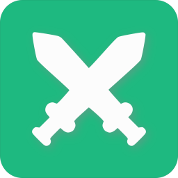
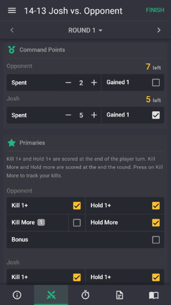

<!-- Badges -->

<!-- PROJECT LOGO -->

  
  <h2 align="center">ITC Battles App</h2>
  

    A Warhammer 40k ITC Champion's Mission helper app for Web, iOS and Android.
     
     
    
    
    
     
    <a href="https://github.com/joshdeboer/itc-battles-app/issues">Report Bug</a>
    ·
    <a href="https://github.com/joshdeboer/itc-battles-app/issues">Request Feature</a>
  

<!-- ABOUT THE PROJECT -->
## About The Project

This repo is used for tracking issues and project planning, the codebase itself is private.

### Built With

* [VueJS](https://vuejs.org/) - The Progressive JavaScript Framework
* [Quasar Framework](https://quasar.dev/) - Build high-performance VueJS user interfaces in record time
* [Google Firebase](https://firebase.google.com/) - A comprehensive mobile development platform
* [Cordova](https://cordova.apache.org/) - Mobile apps with HTML, CSS &amp; JS

<!-- ROADMAP -->
## Roadmap

See the [open issues](https://github.com/joshdeboer/itc-battles-app/issues) for a list of proposed features (and known issues).

<!-- CONTRIBUTING -->
## Contributing

There are several ways you can contribute to the project if you're interested:
* <a href="https://github.com/joshdeboer/itc-battles-app/issues">Report any bugs you find</a>.
* <a href="https://github.com/joshdeboer/itc-battles-app/issues">Suggest new features</a>.
* Rate or review the app on the <a href="https://apps.apple.com/us/app/itc-battles/id1475052539">App Store</a> or the <a href="https://play.google.com/store/apps/details?id=com.joshdeboer.itcbattles">Google Play Store</a>.
* Share the app with friends.
* Help with the development process on <a href="https://gitter.im/itc-battles-app/community">Gitter</a>.

<!-- CONTACT -->
## Contact

Josh DeBoer - itcbattlesapp@gmail.com

Project Link: [https://github.com/joshdeboer/itc-battles-app](https://github.com/joshdeboer/itc-battles-app)

<!-- Donations -->
## Donations

If you would like support future development of this app, you can donate below. All of the proceeds go towards hosting and development costs.

<!-- ACKNOWLEDGEMENTS 
## Acknowledgements

* 
* 
* -->
